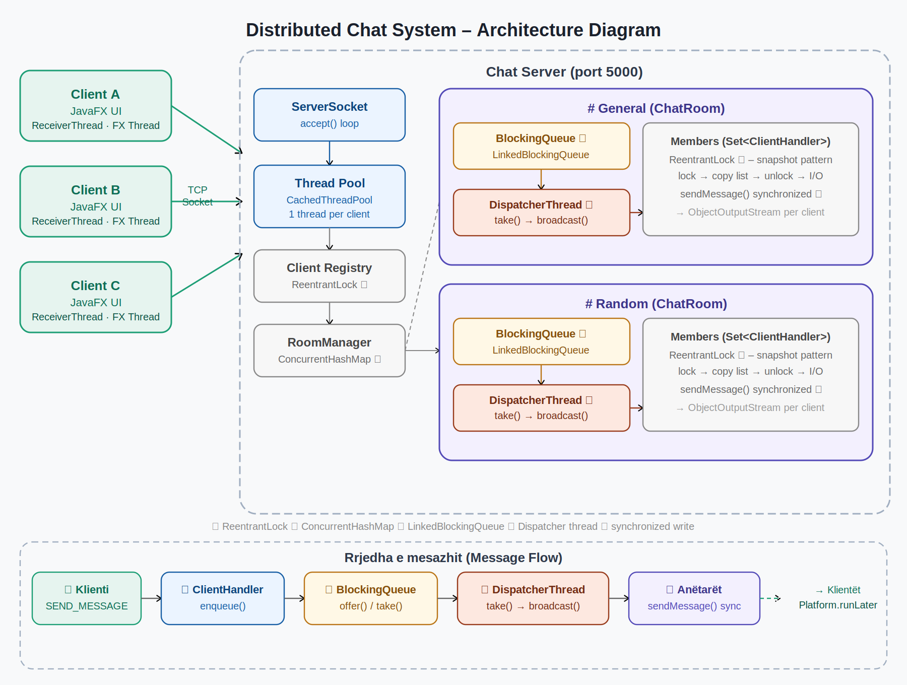

# Distributed Chat System
### Java · Sockets · Multithreading · BlockingQueue · JavaFX

---

## Udhezimet per ekzekutim

### Kerkesat paraprake
| Mjeti | Versioni minimal |
|-------|-----------------|
| JDK   | 17              |
| Maven | 3.8+            |

### Hapi 1 – Build
```bash
cd distributed-chat
mvn clean package -q
```

### Hapi 2 – Nisja e Serverit
```bash
java -cp target/distributed-chat-1.0-SNAPSHOT-server.jar server.ChatServer
```
Serveri starton ne **port 5000** dhe krijon automatikisht room-in `General`.  
Per port te ndryshem:
```bash
java -cp target/distributed-chat-1.0-SNAPSHOT-server.jar server.ChatServer 6000
```

### Hapi 3 – Nisja e Klienteve (minimum 3)
```bash
mvn javafx:run
```
Cdo klient hap dritaren e login-it. Fut `localhost`, `12345`, dhe nje username unik, pastaj kliko **Connect**.

> **Testimi me 3 kliente:** Hap 3 terminale te ndara dhe ekzekuto `mvn javafx:run` ne secilin.

---

## Pershkrim i arkitektures

### Pamje e pergjithshme



### Rrjedha e mesazhit (Message Flow)
```
Klienti          ClientHandler        BlockingQueue      DispatcherThread     Anetaret
   │                   │                    │                   │                │
   │── SEND_MESSAGE ──►│                    │                   │                │
   │                   │── enqueue() ──────►│                   │                │
   │                   │                    │── take() ────────►│                │
   │                   │                    │                   │── broadcast() ─►│
   │◄──────────────────│────────────────────│───── MESSAGE_BROADCAST ────────────│
```

### Klasat kryesore

| Klasa | Paketa | Roli                                                 |
|-------|--------|------------------------------------------------------|
| `ChatServer` | `server` | ServerSocket + ThreadPool + regjistri i klienteve    |
| `ClientHandler` | `server` | Menaxhon nje klient ne thread te vecante (Runnable)  |
| `ChatRoom` | `server` | BlockingQueue + DispatcherThread + lista e anetareve |
| `RoomManager` | `server` | Regjistri i te gjitha room-eve (ConcurrentHashMap)   |
| `Packet` | `shared` | Mesazhi serializable i protokollit (Builder pattern) |
| `CommandType` | `shared` | Enum me te gjitha komandat e protokollit             |
| `ChatClientApp` | `client` | JavaFX GUI + ReceiverThread                          |

---

## Kerkesat teknike – si jane plotesuar

### 1. Multithreading
- `ChatServer` perdore `ExecutorService` (`CachedThreadPool`) — ku cdo klient e merr thread-in e vet
- `ChatRoom` ka `DispatcherThread` te dedikuar per cdo room
- Klienti ka `ReceiverThread` te vecante per marrjen e mesazheve pa bllokuar UI

### 2. BlockingQueue
- `ChatRoom` perdor `LinkedBlockingQueue<Packet>`
- `ClientHandler.handleSendMessage()` → `enqueueMessage()` → fut ne queue
- `DispatcherThread.dispatchLoop()` → `queue.take()` bllokon pa harxhuar CPU, zgjohet vetem kur vjen mesazh
-  **push-based system** — nuk ka polling

### 3. Sinkronizimi
| Struktura                              | Mbrojtja                                         |
|----------------------------------------|--------------------------------------------------|
| `connectedClients` (Map ne ChatServer) | `ReentrantLock` — `clientsLock`                  |
| `members` (Set ne ChatRoom)            | `ReentrantLock` — `membersLock`                  |
| Room map (RoomManager)                 | `ConcurrentHashMap` — thread-safe pa lock shtese |
| `ObjectOutputStream` (ClientHandler)   | `synchronized` ne `sendPacket()`                 |

**Snapshot pattern** — brenda `broadcast()`, lista e anetareve kopjohet nen lock, pastaj lock-u lirohet **para** I/O. Kjo parandalon bllokim te gjate dhe `ConcurrentModificationException`.

### 4. Programimi ne rrjet
- `ServerSocket` ne `ChatServer.start()`
- `Socket` per cdo klient te lidhur
- `ObjectOutputStream` / `ObjectInputStream` per serializim te `Packet`-ave

### 5. Protokolli i komunikimit
Cdo mesazh eshte objekt `Packet implements Serializable` me fushat:
- `CommandType type` — lloji i komandes
- `String sender` — derguesi
- `String roomName` — room-i
- `String content` — permbajtja
- `LocalDateTime timestamp` — ora e dergimit (vendoset automatikisht)
- `List<String> data` — payload per lista (rooms, users)

---

## Problemet e hasura dhe zgjidhjet

### Problemi 1 – Deadlock me ObjectOutputStream
**Problemi:** Te dy anet ndertuan `ObjectInputStream` para `ObjectOutputStream`, duke shkaktuar bllok te ndersjelle (secila priste header-in e streamit te tjetres).  
**Zgjidhja:** Gjithmone ndertoje `ObjectOutputStream` se pari dhe thirre `flush()`, pastaj `ObjectInputStream`.

### Problemi 2 – Cache i vjeter i serializimit
**Problemi:** Objekte te modifikuara dhe te derguara shume here shfaqeshin me vlerat e vjetra sepse `ObjectOutputStream` ruan cache te referencave.  
**Zgjidhja:** Thirre `out.reset()` pas çdo `writeObject()`.

### Problemi 3 – Race condition gjate broadcast
**Problemi:** Iterimi i `members` set nderkohe qe nje thread tjeter thirri `removeMember()` shkaktonte `ConcurrentModificationException`.  
**Zgjidhja:** Merr snapshot te listes brenda lock-ut, pastaj bej broadcast jashte lock-ut (I/O nuk mban lock).

### Problemi 4 – Perditesimi i UI nga thread tjeter
**Problemi:** `ReceiverThread` provoi te azhornonte `ListView` drejtperdrejte → `IllegalStateException` ("Not on FX application thread").  
**Zgjidhja:** Cdo ndryshim i UI mbeshtillet me `Platform.runLater()`.

---

## Lista e testimit

- [x] 3+ kliente te lidhur njekohesisht
- [x] Username i dyfishte refuzohet me mesazh gabimi
- [x] Mesazhet shperndahen vetem tek anetaret e room-it
- [x] Njoftime join/leave dergohen ne kohe reale (push-based)
- [x] Shkeputja e klientit e largon nga room dhe nga map
- [x] Nuk humbet asnje mesazh nen ngarkese paralele

---

## Struktura e dosjeve

```
distributed-chat/
├── pom.xml
├── README.md
└── src/main/java/
    ├── shared/
    │   ├── CommandType.java
    │   └── Packet.java
    ├── server/
    │   ├── ChatServer.java
    │   ├── ClientHandler.java
    │   ├── ChatRoom.java
    │   └── RoomManager.java
    └── client/
        └── ChatClientApp.java
```